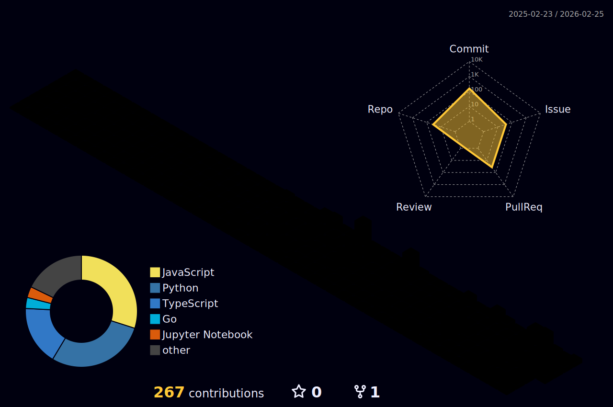

<h1 align="center">
  
</h1>

  

---

### 🏗️ My 3D Contribution City

  

---

### 🏆 3D Achievement Trophies

  

---

### ⚡ Technical Arsenal (3D Icons)

  

---

### 📊 Performance Metrics

  
  

---

### 🚀 Active Projects
- 🔭 **Current:** Building [DSA-weekly-test](https://github.com/vakrahul/dsa-weekly-test-backend) (Spring Boot & React).
- 🧠 **Learning:** Advancing in **Machine Learning Fundamentals** and Intelligent Systems.
- 🤝 **Collaboration:** Open for contributors on [AI_Interviewer](https://github.com/vakrahul/AI_INTERVIEWER).

---

### 🐍 The Contribution Snake

  

---

### 📫 Let's Connect

  
  

  

