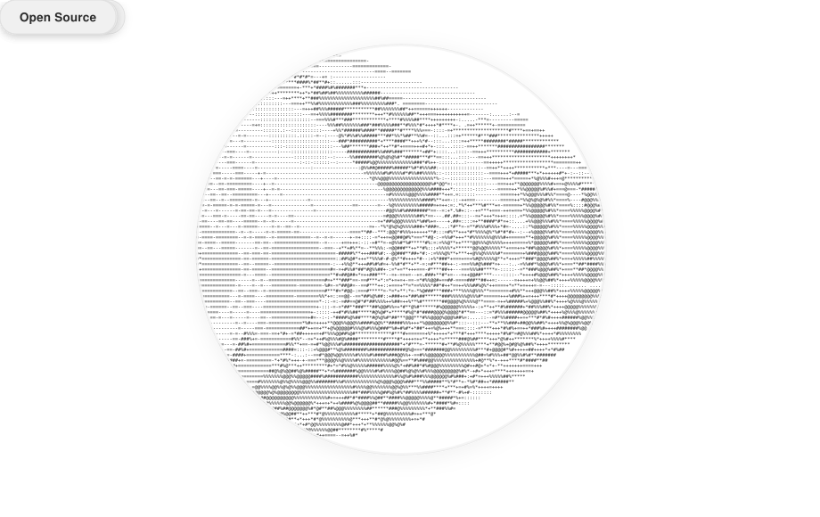

# Hi there, I'm Rahul! 👋
### 🚀 Full-Stack Developer • 🤖 ML Explorer • 🌐 Open Source Enthusiast

 

<!-- ASCII Face Portrait (Renders directly on GitHub) -->

  

  <a href="./index.html"><b>✨ Click here to view the live animated version</b></a>

  

---

### 🐍 The Contribution Snake

  

---

### 📊 GitHub Activity & Metrics

  
  

---

### 📬 Let's Connect

  
  
  

  

